# Scientific Training / How to do a research document

## Defining a research gap

- An interesting research topic must use a method to be good enough

### What is a research

- Is a systematic investigation and study of materials and sources in order to establish facts and reach new conclusions
- Continuous search for better understanding and deepening into a problem
- Research is developed to address a problem: the research gap

### What is a research gap

- Is a topic or area which is missing information, limiting the ability of reviewers to reach a conclusion for a given question
- Overcoming the research gap gives benefits (contributing to real world applications)

## Defining a hypothesis

- A hypothesis is
  - a supposition or proposed explanation made on the basis of limitesd evidence as a starting point for further investigation
  - a proposition made as a basis for reasoning, without any assumption of its truth
  - something that we assume within a topic and we will further investigate it with our research

## Research gap and hypothesis

- The research gap is strongly connected to a hypothesis
- Very likely a first hypothesis will not lead to a defined research gap, because the issue may be already well reported in the literature
- In such cases, we have to refine our hypothesis to achieve an interisting research gap
- Before establishing a research gap, check what has been already done in the field

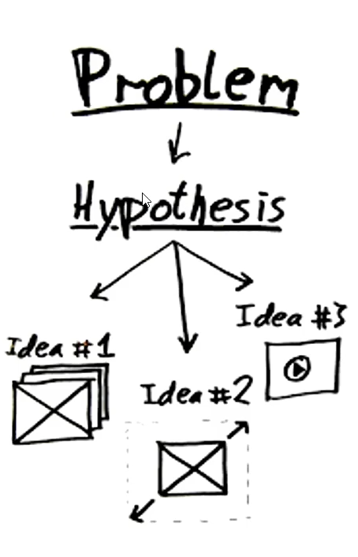

- The research gap is an iterative process developed together with the hypothesis and followed by literature review
- You can only properly formulate your research gap and hypothesis once you perform a thorough literature review

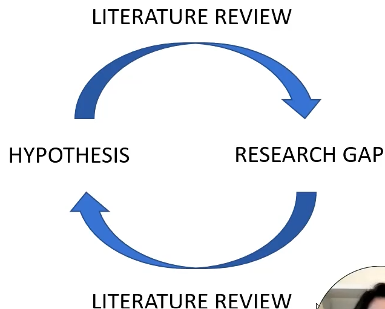

## Finding a research gap

- There are soms steps you can take to help identify research gaps, since it is impossible to go through all the information and research available nowadays

1. Select a topic or question that motivates you
2. Find keywords related terms to your selected topic
   - Besides synthesizing the topic to its essencital core, this will help you in the next step
   - Use the identified keywords to search literature
3. Look for topics or issues that are missing or not addressed within (or related to) your main topic
4. Read systematic reviews

## Example: hypothesis and research gap

- For instance, let us assume the following hypothesis:
  - "Covd-19 lockdowns had a negative impact on the mental health of people"
- In such case, an example of key words research would be
  - "covid-19"
  - "mental health"
- It is important to remark that this is a hypothesis which can only be scientifically verified by following a research methodology or by finding a collection of publications on the topic. In the second case, it is no longer a research gap, so the hypothesis should be refined
- If you keep researching, you can narrow down to other topics. For example:
  - *The impact of covid-19 on the mental health of young mothers, or low-income families, or children under 15 years old, etc.*
- Once you start researching and readint what has been published, you will also go through the methodologies:
  - How was the research conducted? what was the methodology? And how were the results achieved?

## Defining the research gap

- The definition of the research gap must be fine tuned with the current ongoing research and what your research has the potential to bring as an interesting contribution
- Once you define your research gap, your hypothesis comes immediately as the outlook you will give to address the defined research gap

> Research gap: non documented problem at scientific papers/researches
> Hypothesis: comes to outlook the research gap

- The research gap is usually defined by the leading researchers of a department or research team
- The research gap will likely lean towards the direction where the leading researchers want to have the work of their group published
- Typically, when students apply for topics (MSc.; Ph.D.) it is within the direction of the department's research and research publications
- Anyone is capable of producing interesting research and finding a key research gap to address, once they:
  1. develop thorough research (50+ articles) through research databases of what has been published lately within the topic of interest, based on key words
  2. they find the combination of what both interests them (to performa as a methodology) and what needs further deepening outlook within the research community

## Correct Methodology

- When the research gap is defined, the next step is to apply the aappropriate methodology to tackle the problem on hand
- For instance
  - Statistical analysis
  - Questionnaire forms
  - Simulations
  - Coding
  - etc.

## Literature Review (Why Literature Review)

- Get yourself oriented in the field
  - See the topics, the state of the art
  - Get familiar with the terminology and the style of writing

- Build your research on a serious basis
  - You can use findings of previous authors
  - You need to use proved methodology!

- Is it really something new?
  - Maybe it has been done
  - Maybe you are doing it wrong

### The first steps

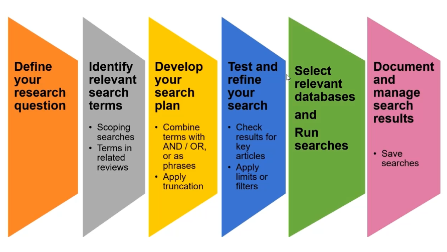

- You should already know the topic of your research/interest
- I you do:
  - What are the keywords for its description?
  - Do you know the corret terminology in English?
  - What are the synonyms of your keywords?
  - What are narrower/broader terms?

### Pratical Example

- Analysis of Noise Reduction in Education Buildings
- You want to know the acoustic issues in education buildings, ways of noise propagation, common measures of noise reduction, etc.

| Keywords                      | Synoyms, related terms                    |
|-------------------------------|-------------------------------------------|
| Education building acoustics  | Noise in schools, Noise in universities   |
| Building structures           | Acoustic walls, Building acoustics        |
| Noise propagation             | Sound propagation, Noise/Sound spreading  |
| Noise reduction               | Noise control, Mitigation, Abatement      |
| Noise attenuator              | Silencers, Noise dampers                  |
| Sound insulation              | Sound insulation                          |

> Keep adding to your list

### Not sure with the terminology?

- Online Sources
  - Wikipedia
  - Google Scholar (and others)
  - The Oxford English Dictionary (OED) - paid
  - Merriam Webster Dictionary - free
- Books and Papers
- Profesional Thesaurus
  - Thesaurus.com
  - Mathematics Subject Classification
  - MeSH (Medical Subject Headings)
  - IEEE Thesaurus and Taxonomy
  - GEMET
  - EUROVOC

### Logical Operators

- It is possible to combine your keywords to make your search more effective
  - AND, OR, NOT
  - Substitute Symbols
  - Parnethesis "" (Tells the search engine to look for the exact sentence, in the exact order)
  - Filters

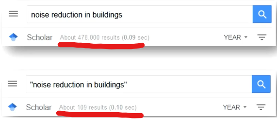

- Use Advanced Search Functions
  - (sulphur OR sulfor) ... sul*ur ... sul?ur
  - dissertation site:harvard.edu ... (searches only one site)
  - +nose ... (word ,,noise'' musb be included in the results)

### Advanced Search On Google Scholar (generally applicable tips for all GOOGLE searches)

- (noise OR sound) "education building" -Health (- excludes word)

- AND is added automatically (not necessary to specify)
- OR can be substituted by the symbol |
- NOT cannot be used, use the symbol - (minus)
- Use " " (hyphens) for multiple-word-term search
- Symbom * substitutes the whole word
- You can use the operator (site, allintitle, author, etc.)
- Check Google Manual for more

## How to efficiently google information

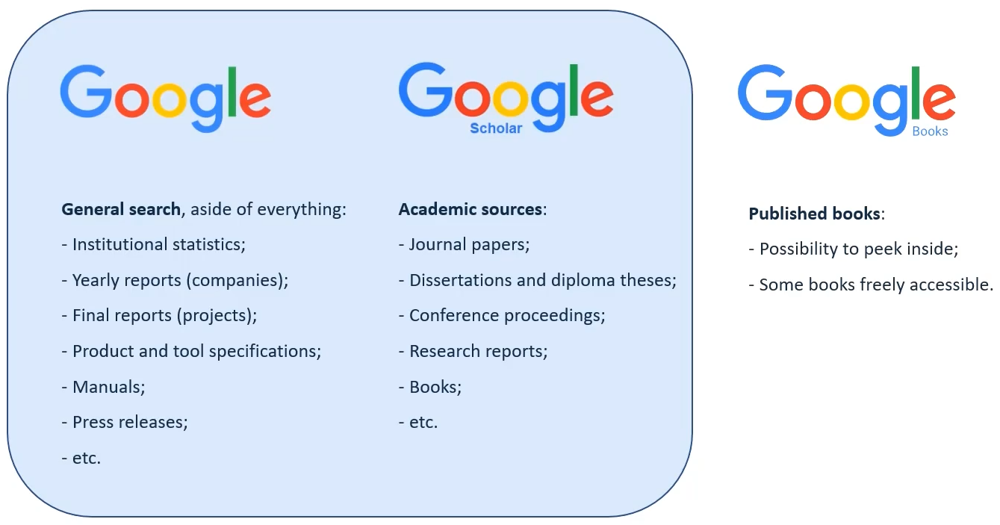

- Google Patents
  - Variuous patent offices;
  - USA, EU, Germany, Canada, China...

- Google general search
  - Searches through all pages
  - Offers lots of results
  - Indexes according to many factors keywords, reliability, currency, place of connection (Prague, Brasília), paid results, etc...
- Google Scholar, searching through academic sources only
  - Offer less results
  - Most likely more relevant
  - Advanced functions for academic search
  - Indexes according selected criteria: relevance, date of publishing...

### Various sources of information

- Wikipedia.org
  - Very good to get a basic idea about the topic
  - Very good to learn English terminology
  - Many contributors, lot of content
  - Mentions original sources of information!
- Be aware
  - Quality control to some extent only!
  - Always double check the information
  - Never cite Wikipedia in your work

### Various sources

- Handbooks, Textbooks, Encyclopedias
  - Very good to get familiar with terminology and general context
  - Good to find connections among topics
  - Easy to identify, generally known.
  - Well accessible (colleagues, tutors, libraries, online)
- Student Theses (BSc., MSc., Ph.D.)
  - Can contain good literaute review
  - Always contains list of sources (references)
  - Can show you common keywords, methods
  - Publicly available (university repositories, online...)
- BSc., MSc., Theses
  - Quality is sometime questionable!
  - Can mislead reader by purpose
  - Can contain mistakes
  - So be critical
- Ph.D. Theses
  - Usually high quality (thorough review process)
  - Usually contains extensive literature review
  - Usually represents state of the art
- Published papers
  - Show style of writing in the field / terminology
  - Show common methods / tools / devices
  - Show how are data gathered
  - Show ow are the results interpreted
- Be Aware
  - Prefer papers from renowned journals (peer-reviewed)
  - Prefer papers from trustful author
  - Prefer papers which offer "full and clear picutre"
- Published Review Papers
  - It is like to hit a jackpot!
    - Somebody did the review for you!
  - Extensive list of sources
  - Prearrange in a understandable way
  - Often offers in-view of senior researchers
- Be Aware
  - The review paper can be old
  - The author could miss something (nobody is perfect)
  - Always check current state of the art and do additional review
- Use Google Scholar
- Renowned citation databases and databases of publications
  - Topic will be targereted in the following Module

### Reading

- Smart- Careful - Mindful
  - Be smart and picky
  - Do not read everything! Read with a TARGET
  - Focus on abstract, conclusion, and specific issues first
  - Very relevant sources read slowly and carefully
  - Less relevant sources keep for later
  - Make notes from the very beginning

### Quality assessment of papers

- Be critical
  - Avoid papers with bad grammar
  - Avoid papers with bad referencing
  - Avoid papers with relevant information missing
  - Use your best judment
  - It is not a rocket science

- Craap Test

  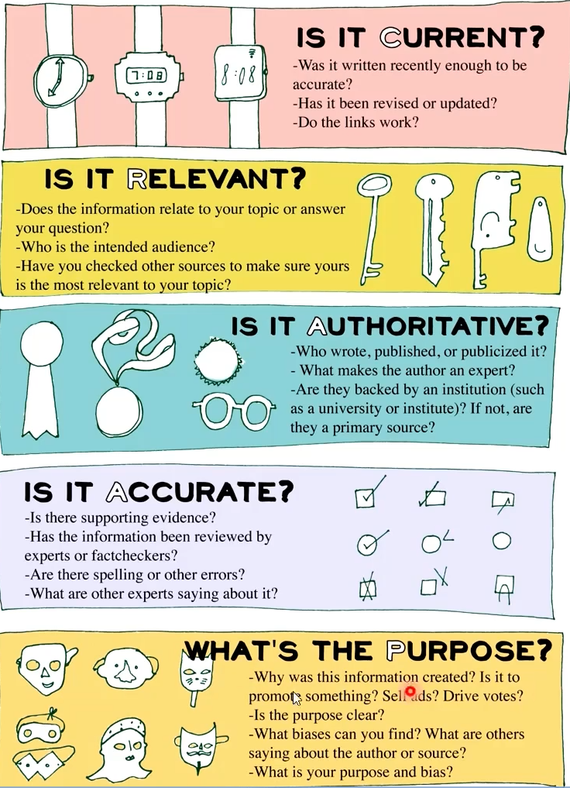

### From our Experience

- Be systematic
  - Organize your resoures and their citations
  - Use (any) ranking system
- Make Notes!
  - All the time and from the beginning. So you don't have to read again
  - Pinpoint important findings. (ideas, methods, comparisons, discrepancies...).
  - Use colours, highlights.
- Check the references
- Use citation tools (Mendeley, Zotero, JabRef - integrate with Latex, EndNote)
  - Download and manage citations
  - Create personal library, folders
  - Insert flags and notes
  - Collaboration
- Integrate with word processing software tools
  - Easy insertion of citations
  - Generation of reference list

## Databases of Peer-Review Literature

- Resources of The Modern Knowledge

### Resources Of Knowledge

- In the past
  - Knowloedge shared by written communication between individual scientists(letters)
  - Limited amount of books
  - Somo journals(only 18th century)
- Nowadays
  - Many books
  - Many conference proceedings
  - Uncountable Scientific articles

### The good, the bad and the ugly

- The good
  - Vast amount of relevant up-to-date information available upon few clicks, if done right
- The bad
  - It can be difficult to get oriented
  - It can be overwhelming, time consuming and contra productive
- The ugly
  - Not all the information are good quality!
  - Lot of bad publications(writing only to have a publication, predatory journals without peer-review, etc...)

### In Search of Quality (Renowned journals)

- Assure quality of content
- Each paper goes through a rigorous peer-review by other lead scientists
- Assessment if the research was done well:
  - The background is resoanable
  - The methodology fits
  - The data are correctly processed
  - There are no logical mistakes
  - etc...

### In Search of Quality (Renowned citation databases)

- Assure quality of sources
- Rigorous peer-review of the accepted (referenced) journals
- Very strict criteria, board of experts
- Developed metrics for authors, journals, conferences, books
- They can help you to find most relevant up-to-data publications

### Google Scholar - Be Aware

- Google Scholar collects research papers form all over the web
- Also including grey literature and non-peer reviewed papers and reports

### Quality metrics - Journals

- Quantify the importance of the journal
- Measurement of quality / impact of the journal
  - Journal Impact Factor (Web of Science)
  - CiteScore (Scopus)

### Journal Metrics - Journal Impact Factor (WoS)

- The Impact Factor is a measure of the frequency with which the articles in a journal has been cited in a particular year
- Two years span back - and the Impact Factor is used in the following year
  - IF = Citations(y) / (Publications(y-1) + Publications(y-2))
- For example Impact Factor of Nature for 2017 (reported in 2018)
  - IF(2017) = Citations(2017) / (Publications(2016) + Publications(2015)) = 74090/(880+902) = 41.577

### Journal Metrics - Citescore (Scopus)

- CiteScore is based on the number of citations to documents (articles, reviews, conference papers, book chapters...) by a journal over four years, divided by the number of the same document types indexed in Scoups and published in those same four years.
- Longer period = usually higher than impact factor
  - Cs(y) = (Citations(y) + Citations(y - 1) + Citations(y - 2) + Citations(y - 3))/(Publications(y) + Publications(y - 1) + Publications(y - 2) + Publications(y - 3))
- For example Impact Factor of Nature for 2019 (reported in 2020):
  - Cs(2019) = (Citations(2019) + Citations(2018) + Citations(2017) + Citations(2016))/(Publications(2019) + Publications(2018) + Publications(2017) + Publications(2016)) = 243894 = 51.0

### Predatory Journals

- Avoid under any circumstances
  - Biased journals (publish everything for a payment)
  - Tricking researchers to publish in them
  - Do not use them, do not publish in them
- How to identify them
  - Supicious behaviour
  - Payment for publication
  - Very short terms (no peer-review)
  - Sometives very similar to a renowned journal
  - Check Beall's list

### Renowned Databases

- Vast amount of information that must be filtered
- As mentioned in the previous modules:
  - Search in a clever way
  - Do not read everything
  - Work with Keywords
  - Use logical operators
  - Use advanced search engines
  - etc...

### Overview of the databases

- Databases of citations and abstracts
  - Basic info about the paper (Name, authors, keywords, abstract...)
  - Provides link to full text (web of journal of Publisher...)
  - The search is free, the full text sometimes (open-access papers and journals)
- Databases of Publicationss
  - Full text available
  - The access may be paid (check your university / library)
- Example
  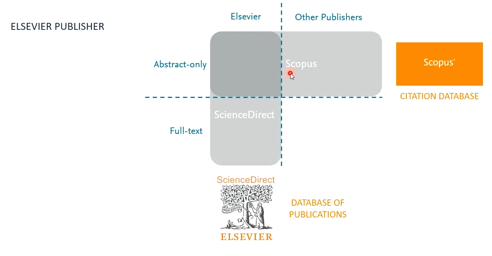

### Databases of Publications

- Science direct
  - Physical Sciences and Engineering
  - Social Sciencies and Humanities
  - Life Sciences; and
  - Health Sciences

- Springer Link
  - Multidisciplinary
  - Natural Sciences and Engineering
  - Medicine and Health Sciences; and
  - Social Sciences and Humanities
  - Mathematics
  - Compute Sciences
  - And Others

- Wiley Online Library
  - Natural Sciences and Engineering
  - Medicine and Health Sciences
  - Journals and E-Books

- Ebsco Host
  - Natural Sciences and Engineering
  - Social Sciences
  - Economics, Finances and Marketing
  - Journals, E-Books and Proceedings
  - Collections of Images

- IEEE Xplore Digital Library
  - Electrical Engineering mainly
  - Journals, E-Books, and Proceedings

- Knovel
  - Techinical sciences and Engineering
  - Journals, Manuals and Encyclopedias

### Open Access Sources

- Freely available research outputs, publications
- Funding models that do not require to pay (public fundings, author covers publication fee)
- Main Ideia
  - Remove the barriers
  - Enhance the movement of peer-review research literature
- Risk
  - Quality
  - Use only renowned Journals
  - Check well known publishers - Elsevier, Clarivate, Wiley...
- www.doaj.org
- core.ac.uk
- www.base-search.net
- www.openaire.eu (European Comission)
- www.v2.sherpa.ac.uk/opendoar/

## Citation Tools

- Use Citation Tools
  - Manage downloaded publications, citations
  - Create personal library, folders
  - Insert tags and notes
  - Collaboration
- Integrate with MS Word, Latex
  - Easy insertion of citations
  - Generation of reference lists
- Tool Suggestions
  - Mendeley
  - Zotero
  - JabRef (integrate with Latex)
  - EndNote

## Academic Writing

### Structure of The Paper - IMRaD

- IMRaD - Introduction, Methodology, Results and Discussion sections
  - Internationally recognized, people are used to it
  - Well proved and adjusted since 1940s
  - Applicable for layout of thesis, report and much more
  - Undersandable, helps writer as well as reader
  - Flexible, adaptable without strict rules
- There is a logic preparing your chapters - Different chapters have differente purposes

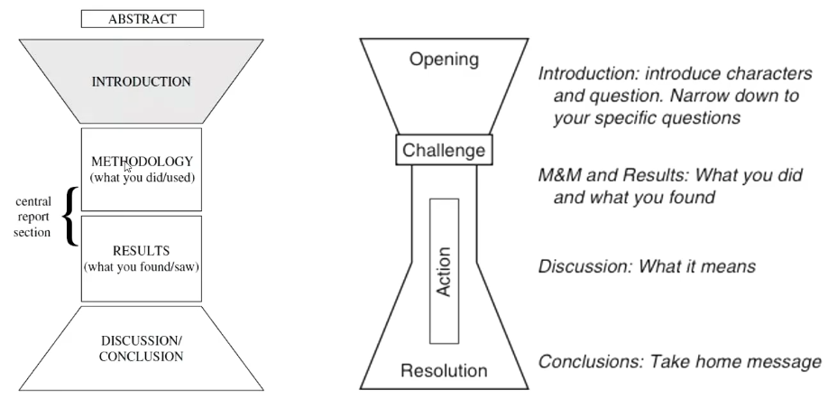
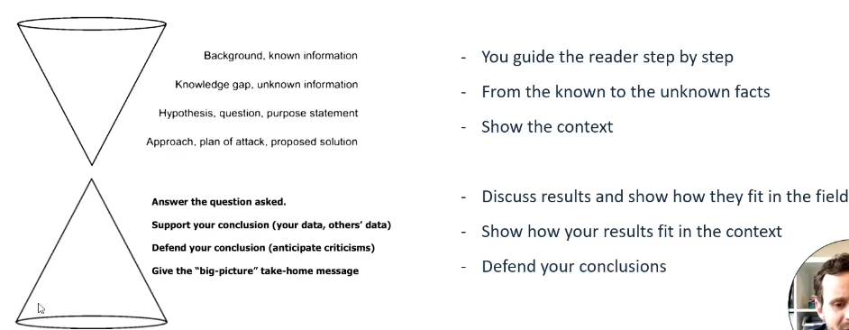

### The Journey

- It is good to first stop, think ahead and do a little planning.
- The following steps coudl help you to stay on the good path:
  - Step 1 - Market need - WHAT/WHO do you target?
  - Step 2 - Make a concept (sketches, concept sheets, mind maps, stickers, notes...)
  - Step 3 - Make a first annotated content - so you know what to write in your chapters (individual chapters will be described in following lectures)
  - Step 4 - Go and write your paper
  - Step 5 - Check the outcome - clarity, readability, visual presentation (sometimes good to wait to, "settle it down")
- Market need - What/who do you target?
  - Your market are your readers

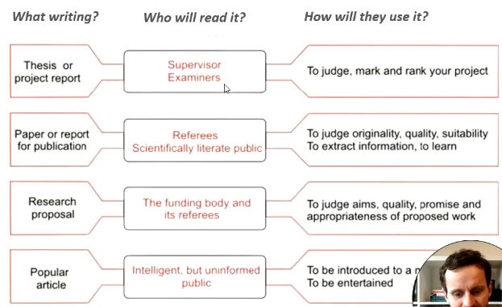

- Concept of the paper
  - To get your ideias organized, to structure your thinking
  - To realize the connections and missing parts
  - Keep the "Freedom of thought"
  - Don't worry about style and form (whatever suits you)
  - Don't worry to adapt

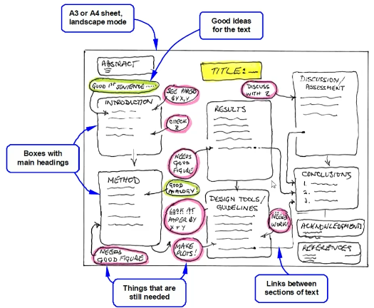

- The First Draft
  - Open your computer
  - Write down your chapters
  - Make a first brief content, bullet points, etc.
  - Don't worry about grammar, style and form
  - Check if your chapters logically follow
  - Edit, edit, edit

### Finally Full-Speed Writing

- The process - The Usual Way
  - It is usually good to start with the straight forward sections - methodology, results, discussion
  - Keep the introduction and the conclusion for later
  - Keep the abstract and keywords for the very end (if you have the option)
  - Keep the graphical and language editing for the end

> But don't hold yourself! --- Do whatever works for you the best

### Finaly Starting To Write General Rules

- Keep it simple
  - Be clear and precise
  - Avoid unnecessary fluff
  - Avoid ambiguity
  - Use understandable language, use correct terminology
- Use the correct template!
- Final appearence is very important:
  - Good layout, clear headings, well-designed figures
  - Always double-check you grammar

## Title, Abstract, Keywords (The Grabbers!)

- Out of the IMRaD scope
- Used for scientific databases and search engines, often stand alone

### The Title First

- Your title is your first impression
  - No more than 12 words
  - Convey something about your subject
  - Focus on what you investigated and how
  - Be concise, clear and use keywords prominently
  - Avoid ambiguity
  - Use "good" English
- Common types of titles - CHOOSE STRATEGICALLY!
  - Noun phrase; <-- Noun phrases are the most common type, but not always the best one (sometimes too vague)
  - Statement; or <-- Easily summarizes results
  - Question; <-- Attract readers, gets the right idea about the main issue
- Avoid ambiguity
- Use "good" English - Grammatically and Stylistically

### Title Capitalization

- Common way how to write your title with some rules and some choices
- Headline-style capitalization
  - Capitalize the first letter of the first and last words of the title and subtitle and all other words, except as follows:
    - Do not capitalize articles (a, an, the), cordinating conjunctions (and, but, or, nor, for, so, yet), or the words to and as.
    - Do not capitalize the second part of a hyphenated compound, unless it is a proper noun or adjective (Self-government, Mid-Atlantic)
    - Do not capitalize parts of proper nouns that are normally in lowecase (Ludwig van Beethoven)
    - Do not capitalize prepositions (of, in at, above), unless...
      - Capitalize if first or last word
      - For other positions within the title, opinions differ...
      - Chicago style: Lowercase unless are emphasized (A River Runs Through It), used aas adverbs (Look Up), adjectives (The On Button) or conjunctions (Look Before You Leap) / Do not capitalize long prespositions (according, underneath)
  > Campus Architecture: Building in the Groves of Academe
  > Green Buildings - A Step towards Environmental Protection
- Sentence-syle capitalization
  - Capitalize only the first letter of the first word of the title and subtitle
  - Capitalize any proper nouns and proper adjective thereafter (following English Grammar)
  > Design by optimizqation in architecture, buildings, adn construction
  > Building change: Architecture, politics, and cultural agency
  > Natural crisis: Symbol and imagination in the mid-American farm crisis
- Save yourself some work and use the capitalization tools
  - [capitalizemytitle](www.capitalizemytitle.com)
  - [headlinecapitalization](www.headlinecapitalization.com)
  - [titlecaseconverter](www.titlecaseconverter.com)

### Get the Abstract Right

- Overview of the main story with limited lenght - gives the highlights. approx. 300 to 400 words
- Very important! Publicy available everywhere
- Don't do a sloopy job!
  - If oftens stands alone
  - It is often sent/evaluated ahead of the paper (conference application)
  - Very often the only part people read, unless It succeeds in convincing!
  - Some readers may only have access to the abstract (papers are paid)

> An abstract should report what you did, not what you plan to do, so avoid language like hope, play, try, or attempt. Use the past tense to indicate that the study was already completed

- 2 common types of abstract
  1. Structured - similar to the paper (can have subheadings), deals with all the main subsections of the paper
  2. Focused - more common - targeting 1 or 2 main aspects of the study, usually the method and the results

- The selection usually depends on the author
- Sometimes a specific form is requested (i.e. extended abstract)
- Just a little summary
  1. Follow the guidelines
  2. Be sure the abstract has everything you need - no more, no less.
  3. Be specific, avoid vague fluff, pinpoint context of the research and important findings
  4. You can report you key results and conclusions (but the details keep for later)

> Tip: Because you have to put so much into a short body of text, writing an abstract can definitely be challenging.

> To Improve your abstract-writing skills, review abstracts of articles in journals and in conference proceedings to get an ideia of how researchers in your field approach specific subjects and research

### The word of keywords

- "A word, an expression, or a concept of particular importance of significance"
- Most journals and conferences now expect authors to provide key words
- Key words are used by search engines to locate the paper
- Between 5 to 10 words are normally required
- They should the most closely reflect the content of the paper
- Some useful tips
  1. Include your thechniques and/or specific methodology
      > The most important techniques are worth mentioning (X-ray Crystallography, Real-time PCR, CFD Simulation, etc.)
  2. Focus on the main topic of your research
  3. Avoid overlapping keywords in your title and those in your keyword list
  4. Perform keyword research before submitting your article

> A Manual for Writers of Research Papers, Theses, and Dissertations' by Kate L. Turabin; provides detailed ideas on choosing keywords for your publication.

## Introduction and Methodology

### Introduction Section

- Draw-in your reader, get attention and explain very clearly the issue on hand and what you do about it
- Be specific and clear
- No reading betweel the lines
- Avoid unncessary fluff and vague information
- Focus on knowlodge gaps

- Step by Step
  1. What's known
  2. What's unknown (limitations and gaps in previous studies)
  3. Your burning question / hypothesis / aim
  4. Your experimental approach
  5. Why your approach / results are new and different and important (fills in the gaps)

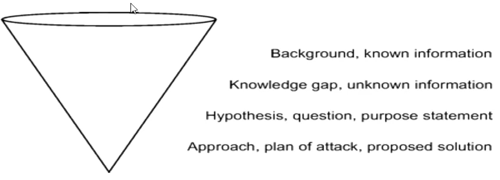

#### The main task of the introduction section

- To take the reader step by step from what is known to what is unknown
- To put your work into the large perspective and narrow it down
- To present your specific questions
- To emphasize how your study fills in the gaps
- To demonstrade the need for your research

> A good opening provides direction from the very beginning

#### Little Tips

- Write for a slightly more general audience
- Keep paragraphs short
- Explicitly state your research question / aim / hypothesis: "We asked whether"; "Our hypothesis was"; "Our aims were"
- Do not answer the research question (no results or implications)
- Summarize at a high level! Leave detailed descriptions, speculations, and criticims for the discussion
- The first sentence / paragraph is VERY IMPORTANT! Try to set the tone and make an impression (i.e following example)

#### Keep the balance - Matching the opening to the results

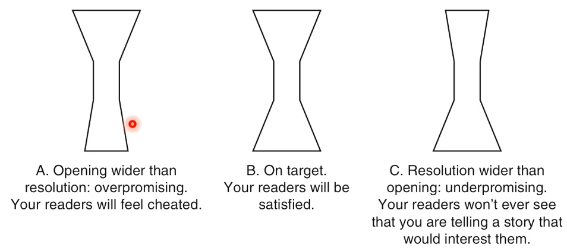

> Vocabulary for introduction (material)

### Methodology

- You provide specific details about your work process
- You present your tools and your approach
- You demonstrate that you used proved and correct tools / ways
- You relate your methods to other studies
- You show solid basis of your work
- It should contain enough detail for the study to be repeatable (i.e it should be possible to replicate / check your findings / results)
- If your encontered any problems indicate them - and show their influcence on the results (this is critical - reader should not be finding issues that are note mentioned in the paper)
- Be aware: Good methodology section adds credibility to the results and vice versa
- To further make life easy for your reader, you can:
  - Cite a reference for commonly used methods, for example
    - "We measured microbial biomass by the chloroform slurry approach as described by Fierer and Schimel (2003)." ---> Perfect! This provides you with a "shortcut", shows serious background, adds credibility...
- Display information and processes in flow diagrams, tables and graphics where possible

#### Methodology section recipe (Not all will always apply)

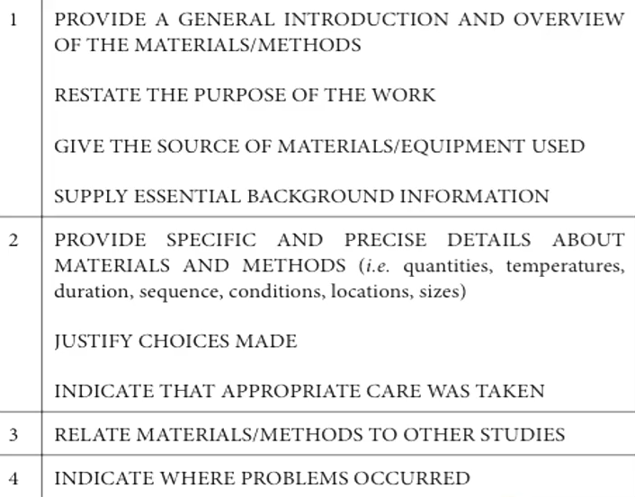

## Results, Discussion and Conclusion

### Results (The ksy driver of an article)

#### The main task of the results section

- Present the hard data as an evidence to support your research outcomes
- Summarize what the data show
- Point out simples relationships
- Descrive big-picture trends; highlight important findings
- Don't forget to present negative and control results

#### Usefull tips

- Break the chapter into subsections, with headings (if needed)
- Reserver information about what you did for the methods section
- Reserve in-depth comments on the meaning of your results for the discussion section

#### The results section should be well readable, understandable and effective

- Use figures and tabels to accompany your text

#### Figure, Table, Or Text?

- Depends on your point and the message that you want to communicate
- Tables
  - Presenting date (raw or processed)
  - Showing values and their precision
  - Allow multiple comparisons between elements
  - Allow comparisions in many directions
- Figures
  - Showing overall tred or "big picture"
  - Presenting story trough the "shape"
  - Simple comparison between only a few elements

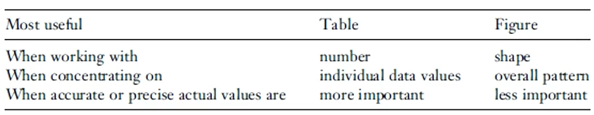

- Usefull tips:
  - Figures and tables should optimally stand alone and tell a complete story
    - The reader should not need to refer to the main text
    - However, you may write a commentary to the presented figures and tables
    - (Complement the information that is already in tables and figures)
  - In the main text, avoid simply repeating the numbers that are already available in tables and figures
    - Repeat / highlight only the most important numbers
    - Give precise values that are not available in the figures
    - Report the percent change on percent difference if absolute values are given in the table
  - Cite and locate figures or tables that present supporting data
    - The figure/table should be after its citation in the text
  - Use good titles of figures and tables
    - Summarize the content
    - Highlight key points
  - Show understandable legends in the figures
    - Explain well what is presented
  - Do not forget units!

#### Results section recipe (Not all will always apply)

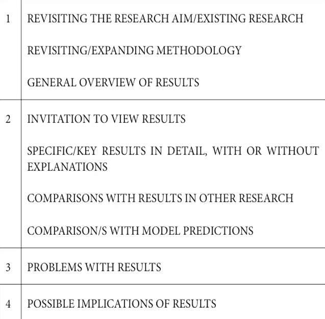

### Discussion section

- The main task of the discussion section
  - Answer question asked
  - Support your conclusions - by your data, other researchers data etc.
  - Defend your conclusions - and anticipate criticism
  - Provide the "big-picuture" take-home message to the reader
  - Don't forget to present and defend difficulties/weaknesses
- If you have any difficulties/weaknesses you should mention them - and defend them
- Otherwise reader may not trust your results (if they find on their own)
- It is also considered as a stronger paper, if you do this

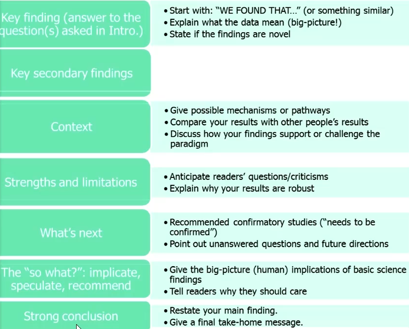

#### Pratical tips

- Tell it like a story
- Use the active voice
- Use a bit more popular language to address a wider audience
- Make sure it connects clearly with the issues you raised in the introduction
- Start and end with the main finding
- Focus on what your data prove, not what you had hoped your data would prove
- Focus on the limitations that matter, not generic limitations

#### Discussion section recipe (Not all will always apply)

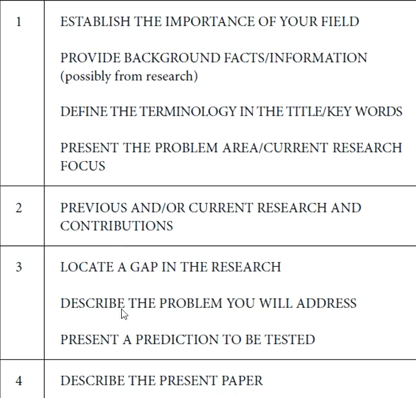

### Conclusion section

- End with the powerful stuff
- Conclude your story, restate main targets, sumarise the main findings and contributions
- Useful Tips
  - Last words are poweful. Don't blow the punchline
  - New question? Make it concrete and show how it grew from your work. "More research is needed" poses question about the work.
  - Avoid any shocking "plot twists"!

## Final Editing

- The first draft is black and white, editing gives your story colour
- Good designs supports the first impression
- You want to present your work well
- You want to please your readers
- You want to pass the review

### Topics to discuss

- The text
  - Grammar and stylistics, correct terminology
  - Structure, flow of the story;
  - Relatoins between the sections.
- Layout and visual elements
  - Fonts styles, sizes, spacings, formatting in general;
  - Position of visual elements, division of paragraphs;
  - Quality of images, readability of text in visual elements.
- The little bugs
  - Symbols, numbers, units;
  - Cross-referencing of figures and tables, titles;
  - Numbering of equations
  - Proper referencing of sources

### What to remember

- Always follow the provided template/formatting rules
  - Check the conference or journal web pages;
  - Download or request the template (preferably editable)
  - Be sure that you are using up-to-date information
  - In this case do not be creative, just follow the rules

### Editing the text

1. Take a break
2. Read carefully, don't be sentimental, let the ink run

- The Process

1. Read Fast the whole paper:
   - As your future readers
   - See if the story makes sense and follows up
   - See if everything is understandable
   - Eliminate redundancies of information
   - Check the connection between the chapters
   - Check if anything is missing or needs further clarification
   - Dont't worry to add visual elements where appropriate
   - Don't be sentimental - erase, erase, erase - words, sentences, paragraphs
2. Read slowly and carefully each paragraph
   - The text should be clear and easy to read
   - Simplify clunky language
   - Avoid complicated word choice
   - Revice unnecessary words (no fluff)
   - Avoid very long sentences
   - Avoid multiple use of the same word (use synonyms - MS Word, Google, various thesauri)
3. Check the little things - the last check
   - Grammatical errors.
   - Spelling mistakes
   - Typos

### Tips and Tricks

- For reading/editing purposes, change the line spacing of your work to double-spaced, and font to Courier New, size 12
  - Easy on the eye, fast reading (1 page per minute), simplify spotting mistakes
  - Good both for printout and sceen
  - Space for notes and comments
- Always use automatic spelling and grammar check - MS Word
  - do not trust it absolutely
- Use WriteFull / Gramarly / ProWritingAid / After The Deadline

### Layout and visual elements

- Always follow the templates/information provided
- Work directly with the provided template document
  - First page layout
  - Fonts and formatting
  - Headings and subheadings
  - Lists and bullet points
  - Titles of figures and tables
  - Numbering of figures
  - And others

### Play with your layout

- Aside of the top part of the first page
- Clever position of figures, tables and visual elements
  - All of them should be cross-reference in the text
  - Reference in the text should be first (optimally)
  - On the same page as the reference (optimally)
- Clear division of paragraphs
- Use bullet points and lists

### Images and Visual Elements

- Always print out your paper and check all the visual elements
  - Quality of images
  - Readability of text in visual elements:
    - Graphs - names of axes, numbers, legends...
    - Schematic diagrams - accompanying text...
    - Text in any image...
- Notice: do not forget to translate in all the images and visual elements!

### The Little Bugs (The final check)

- Symbols, numbers, units
  - Meaning of all symbols and variables should be explained
    - either in the text (i.e. after the symbol, below the equation...)
    - or add list of symbols if necessary (or requested)
  - Keep consistency of symbols
  - Use proper formatting of numbers
  - Round values, avous too many decimals
  - Be sure that you are using correct units (double check)
  - Be consistent with formatting of t he denominator(a/b - a.b(-²))
- Related formatting
  - Symbols - *in italic*
  - Indexes - regular
  - Numbers and units - regular
- Figures and tables
  - Check numbering sequence
  - Check titles of figures and tables
  - Check cross-referencing in the text
  - REMEMBER: All visual elements should be referenced in text
- Numbering of equations
  - Usually in rounded-brackets at the end of the line
  - Be sure to reference all the external sources and non-original information!!! Beware of plagiarism!
- Use plagiarism checker for inadvertent plagiarism
  - www.turnitin.com
  - www.ithenticate.com,
- Ask others to read your final version
  - Family and friends for grammar
  - Colleagues for professional opinion
  - Ask for their impression and frank feedback